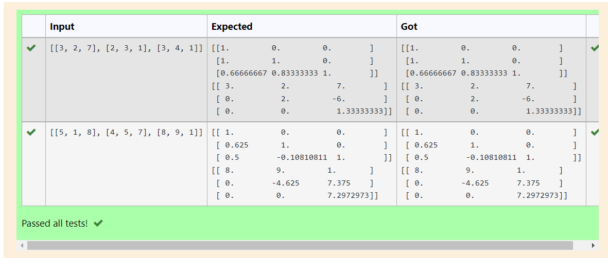
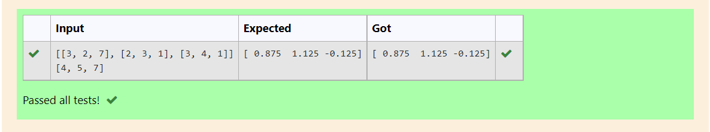

# LU Decomposition without zero on the diagonal

## AIM:
To write a program to find the LU Decomposition of a matrix.

## Equipments Required:
1. Hardware – PCs
2. Anaconda – Python 3.7 Installation / Moodle-Code Runner

## Algorithm
1. import numpy as np
2. import scipy.linalg as lu
3. p,l,u = lu(a)
4. print the value 

## Program:
```
/*
Program to find the LU Decomposition of a matrix.
Developed by:pavan kishore.M 
RegisterNumber:21002328

import numpy as np
from scipy.linalg import lu
A = np.array(eval(input()))
P, L, U = lu(A)
print(L)
print(U)
*/
```


## Output:



## Result:
Thus the program to find the LU Decomposition of a matrix is written and verified using python programming.

# LU Decomposition without zero on the diagonal

## AIM:
Use LU Decomposition to solve a matrix.

## Equipments Required:
1. Hardware – PCs
2. Anaconda – Python 3.7 Installation / Moodle-Code Runner

## Algorithm
1. import numpy as np
2. import scipy.linalg as lu
3. p,l,u =lu(A)
4. print the value

## Program:
```
/*
Program to find the LU Decomposition of a matrix.
Developed by:pavan kishore.M 
RegisterNumber:21002328

import numpy as np
from scipy.linalg import lu_factor, lu_solve
A = np.array(eval(input()))
B = np.array(eval(input()))
lu, pivot = lu_factor(A)
x = lu_solve((lu,pivot),B)
print(x)

*/
```


## Output:



## Result:
Thus the program to find the LU Decomposition of a matrix is written and verified using python programming.